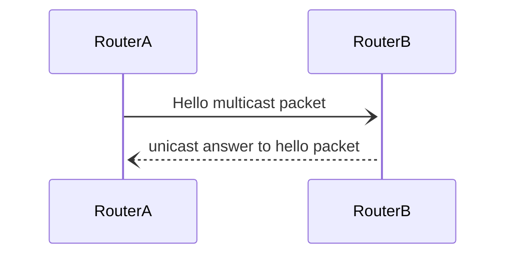
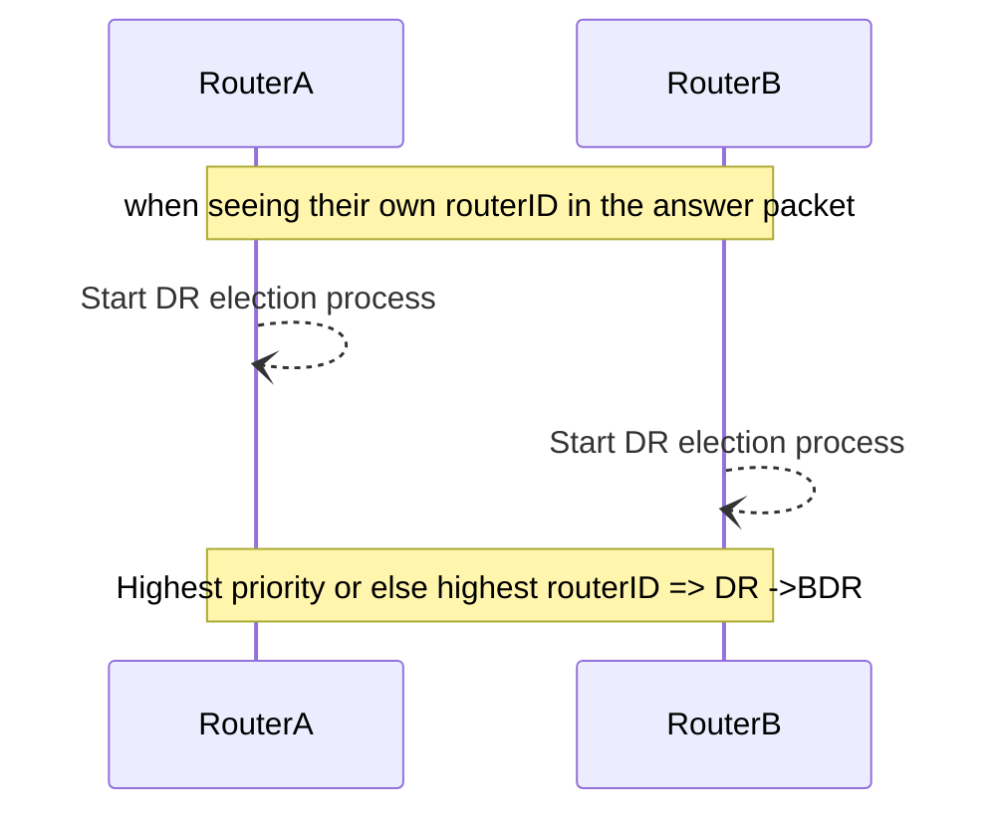
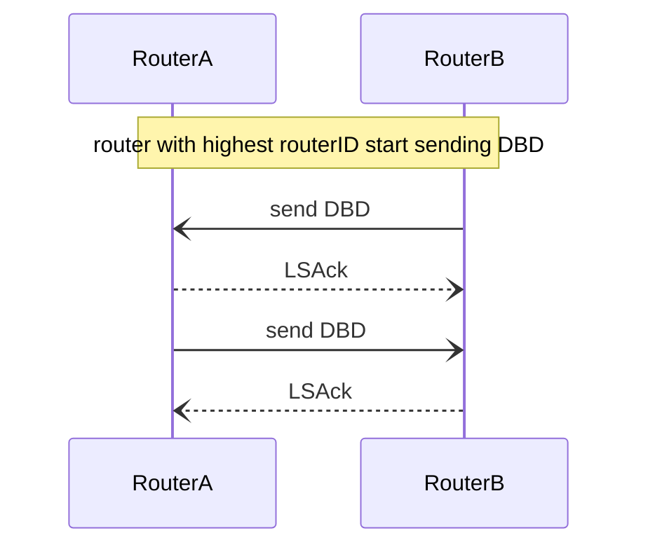
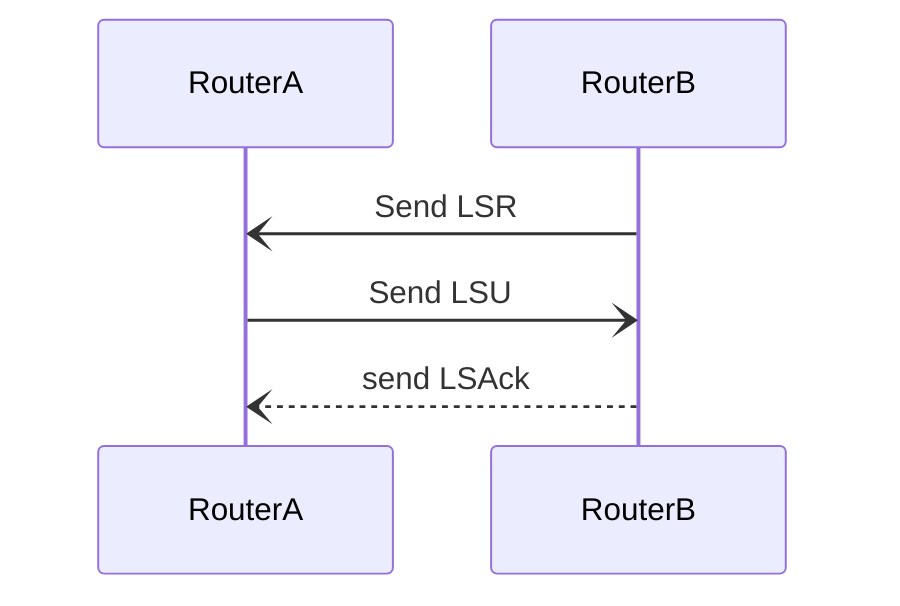
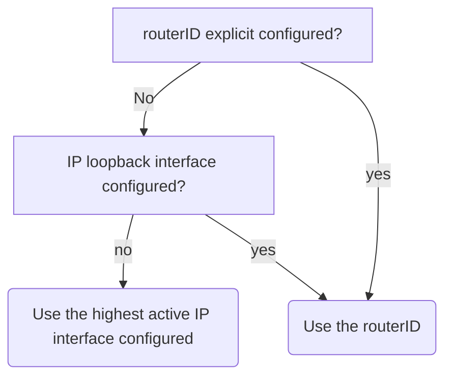

#cisco #routing #ospf

> [!info] link-state = Information about the network prefix, prefix length, and cost
ospf is an IGP - Interior Gateway Protocol
## OSPF  architecture (high level)

>1. Routing protocol messages
>2. Building data structure = DataBase
>3. calculating algorithm = Dijkstra
## Link-State Operation steps
Each router in the OSPF network is processing through the following steps:

1. Establish Neighbour Adjacencies = Hello packets
2. Exchange Link-State Advertisements = LSA's
3. Build the Link State Database
4. Execute the SPF Algorithm -> generate an SPF tree -> runs after every database update
5. Choose the Best Route -> calculated routes are added to the routing table

## OSPF Operational States
### Down state
- This is the state when OSPF is just enabled on a port but haven't send or received a hallo packet jet.

### Init Start state
- A multicast Hello packet is send to, or received from the neighbour.
- Those packets contain the Router ID of the sending router and optionally a list with all the other routerID of neighbours he already knows.


### Two-way state:
1. This state starts from the moment that the router sees his own routerID in the answer packet he received from his neighbour router.
2. The communication between the two routers is bidirectional. This means that the router has received an answer to his multicast hello packet.
3. The router adds the neighbour to his database
4. On multi-access links the DR and a BDR election starts.
5. The router with the highest priority or the highest router ID will be chosen as the DR, the second highest is the BDR (backup Designated Router)
6. DROTHER routers will stay in this 2-way state ( = an adjacency with the DR)

### Exstart state
- On point-to-point networks, the two routers decide which router will initiate the DBD packet exchange. The router with the highest routerID will send its DBD first and decide upon the initial DBD packet sequence number.
### Exchange State
- This state starts when the first DBD packet is send or received. 
- Routers exchange DBD packets. ==The DBD (database description) is a summarised form of the LSDB (Link State Database)==
- On multi-access networks, DBD packets will only be transfered with the DR
- If additional router information is required then transition to Loading; otherwise, transition to the Full state



### Loading state
1. If the router sees a more current link-state entry in the DBD he just received from his neighbour, the router will transition to the loading state by sending a LSR (link state request).
2. LSR (Links state request) and LSU (Link state update) are used to gain additional route information


When a change is perceived (incremental updates)
### Full state
- The link-state database of the router is fully synchronized. LSU's are send when a change is perceived (incremental updates), or every 30min
- Routes are processed using the SPF algorithm


## OSPF Packets

| type| packet | short | description |
|-|-|-|-|
| 1| Hello packet | - | Discovers neighbors and builds adjacencies between them, ==establishing== and ==maintaining== adjacency. |
|2|Database description packet | DBD | This packet contains an abbreviated list of the sending router LSDB, it contains all the header LSU information|
|3|Link-state request packet | LSR | Requests more link-state information about an entry in his LSDB|
|4|Link-state update packet | LSU | Sends a reply on requested link-state records or send new updates, these consists of 7 different types of LSA's |
|5|Link-state acknowledgment packet | LSAck | Acknowledges any other OSPF packet type, except HELLO packets

### Hello packets in detail
> - The Hello packets are send to multicast address 224.0.0.5
> - Content of a hello :
> 	- The routers own routerID
> 	- A list of all the routerID's of his neighbours. (if he has already neighbours)
> 	- A request, 'Is there anyone else on the link?'
> - by default hello packets are send every 10sec on a ethernet link and 30 sec on a ptp link

> - Answer to hello packet are send as unicast messages and also contains a list of all the neigbours that the sending router knows. So if the receiving routers sees his own routerID in the reply then he knows that they both know each other.

#### Death interval
- Is the interval in seconds that a ospf interface waits before it will notice that the adjacency with its neighbor is down
	- 4 times the hello interval by default.
### Link State Advertisement (LSA) packets within the LSU 's

| lsa type|description|
|-|-|
|1|router lsa's|
|2|database sync between routers|
|3-4|summary lsa's|
|5| autonomous system external lsa's
|6| acknowledges the other packet types
|7| defined for not-so-stubby areas
|8| external attributes for border gateway protocol (bgp)
|9| intra-area lsa's


## OSPF Databases

| Database | table | description | command |
| -- | -- | -- | -- |
| Adjacency Database|Neighbor Table| <ul><li>Neighbor routers with bi-directional connect</li><li>table = Unique for each router</li></ul>| `show ip ospf neighbor network` | 
| Link-state Database (LSDB) | Topology Table | <ul><li>This database represents the network LSDB</li><li>All routers within an area have identical LSDB</li></ul> | `show ip ospf database` |
| Forward database | routing table | <ul><li>List of routes generated when an algorithm is run on the link-state database</li><li>Each router's routing table is unique and contains information on how and where to send packets to other routers</li></ul>| `show ip route`| 

## OSPF Areas

* **single-area** -> all routers within area 0
* **multi-area** -> backbone network stays at area 0

>	The routing domain is divided into multiple smaller routing domains 
>	will produce smaller routing tables
>	reduced link-state updates
>	less frequent SPF calculations

## OSPFv3 = OSPF for ipv6
## DR and BDR

A multi-access network (multiple routers on one single subnet - L2 net) can create 2 problems:
- An extensive amount of adjacencies
- An enormous amount of LSA flooding over the network (multicast)

>[!info] If there would be no DR and BDR election:
>Calculate the total amount of adjacencies on a multi-access network:
>n= number of routers in the network
>a = n(n-1) / 2

>Without a DR and BDR all the LSU messages would be flooded on the network. Also the amount of LSAck packets could become enormous. This is because every flooded (multicast) LSU packet has to be acknowledged by every router.

>OSPF elects a DR to be the collection and distribution point for LSAs sent and received. A BDR is also elected in case the DR fails. All other routers become DROTHERs. A DROTHER is a router that is neither the DR nor the BDR.


## Cost calculations

- In ospf the Metric of a route is called the cost.
- The lower the cost the better
- reference bandwidth by default = 100,000kbps
- the minimum cost = 1

Cost calculation = reference bandwidth / interface bandwidth


## Router ID selection

Manually configure a router ID -> `router-id 1.1.1.1`
Automatically assign router ID 



#### Use loopback as the routerID
>Instead of relying on physical interface, the router ID can be assigned to a loopback interface. Typically, the IPv4 address for this type of loopback interface should be configured using a 32-bit subnet mask (255.255.255.255). This effectively creates a host route. A 32-bit host route would not get advertised as a route to other OSPF routers


## OSPF Configuration
### Adding networks to the OSPF process

1. In the first example, the wildcard mask identifies the interface based on the network addresses. Any active interface that is configured with an IPv4 address belonging to that network will participate in the OSPFv2 routing process.
```
R1(config)#router ospf 10
R1(config-router)#network 10.10.1.0 0.0.0.255 area 0
R1(config-router)#network 10.1.1.4 0.0.0.3 area 0
R1(config-router)#network 10.1.1.12 0.0.0.3 area 0
```

2. As an alternative, the second example shows how OSPFv2 can be enabled by specifying the exact interface IPv4 address using a quad zero wildcard mask. Entering **network 10.1.1.5 0.0.0.0 area 0** on R1 tells the router to enable interface Gigabit Ethernet 0/0/0 for the routing process. As a result, the OSPFv2 process will advertise the network that is on this interface (10.1.1.4/30).
```
R1(config)#router ospf 10
R1(config-router)#network 10.10.1.1 0.0.0.0 area 0
R1(config-router)#network 10.1.1.5 0.0.0.0 area 0
R1(config-router)# **network 10.1.1.14 0.0.0.0 area 0
```

### Configure OSPF Using the ip ospf Command

```
R1(config-router)#interface GigabitEthernet 0/0/0
R1(config-if)# **ip ospf 10 area 0** R1(config-if)#interface GigabitEthernet 0/0/1
R1(config-if)#ip ospf 10 area 0
R1(config-if)# **interface Loopback 0
R1(config-if)# **ip ospf 10 area 0
```

### configure a Passive Interface
>Use the **passive-interface** router configuration mode command to prevent the transmission of routing messages through a router interface, but still allow that network to be advertised to other routers. The configuration example identifies the R1 Loopback 0/0/0 interface as passive.
`R1(config-router)#passive-interface loopback 0`
## OSPF Commands

#### show commands:

| show ip protocols | include Router ID|
|--|--|
|`R1# show ip ospf interface GigabitEthernet 0/0/0`| ospf interface information |


#### ospf config commands


|command| description|
| -- | -- |
|`R1(conf)# router ospf 10`| start osp process-id 10 |
|`R1(config-router)# router-id 1.1.1.1`| assign a router id|
|`R1#clear ip ospf process`| reload the new ospf configuration |
|`Router(config-router)#network 10.10.1.0 0.0.0.255 area 0`| adding area's|
|`R1(config-if)# ip ospf 10 area 0`| configure ospf on the selected interface|
|`R1(config-router)#passive-interface loopback 0` | make passive interface

#### 