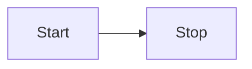
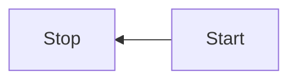
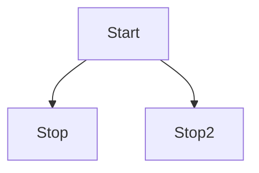
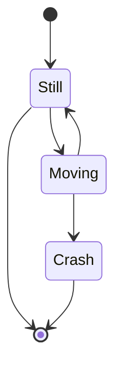
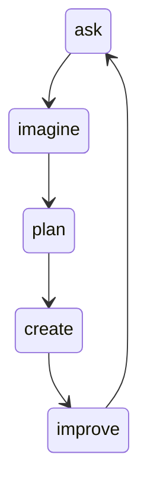

#obsidian 

```mermaid

flowchart LR
Start --> Stop
```

```mermaid
flowchart RL
Start --> Stop
```

```mermaid
flowchart TB
Start --> Stop
Start --> Stop2
```

```mermaid
stateDiagram-v2
    [*] --> Still
    Still --> [*]

    Still --> Moving
    Moving --> Still
    Moving --> Crash
    Crash --> [*]

```

```mermaid
stateDiagram-v2
ask --> imagine
imagine --> plan
plan --> create
create --> improve
improve --> ask
```