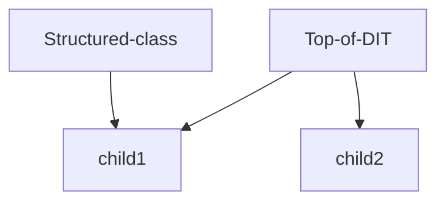

- Is hierarchical tree
- In the sense of LDAP -> Directory = Specialized database
- Objects in the ldap file structure are called entries
- DIT = Directory Information Tree
- Top of DIT = base of suffix = top of the tree
- Entries are build based on Object classes these object classes define which attributes can be used on that class
- Attributes are the placeholders for the actual data
attributes contains the actual values

Structure of a ldif file

All entries in LDAP are based on classes. These classes define which attributes a entry can have.

for example 
## Object classes
- each object class had a unique name
- The object class defines which attributes MUST be present (must / mandatory) and MAY be present (may / optional)
- Each object class has a type. This type can be structural, auxiliary or abstract

>For each entry there MUST be 1 and only 1 STRUCTURAL object class and 0 or more AUXILIARY object classes.

### Object classes hierarchy
The object classes themselves are part of a hierarchy (child/parent object class);  
where a child object class inherits all characteristics from its parent object class  
(as well as the associated attributes)
### Types of Classes

#### 1. Abstract classes
- this class does not need a parent
- The most common ABSTRACT object class is top!
- These object classes are not included in the schematic files such as eg core.schema, cosine.schema…
- It does not include any attributes
#### 2. Structured classes
- Must be applied once and only once on a entry
- It always need a parent
#### 3. Auxilary classes
- can be applied as a extra class to a object
- This object class does contain attributes and may be used in combination with any STRUCTURAL object class
- But this object class cannot be the only entry (the only occurring object class) in the DIT

## Attributes:

- An entry consists of a set of attributes that contains information about the object.
- Each attribute has a type and 1 or more values.