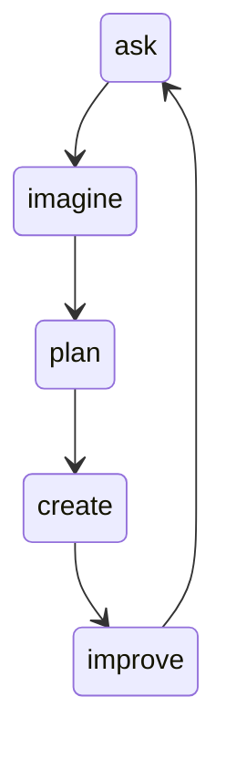

#systemengineering 
# Global project
1. Plan the project
2. Scope the project
what are the boundaries, define the exact problem statement
3. what are the requirements
4. design a solution

# Keuze strategieen

1. poll
2. ranking
3. list all positives and negatives
4. WRM weighted Ranking Method
5. paarsgewijze vergelijking
## WRM
criteria x weegfactor = score
weegfactor = hoe belangrijk is een bepaald criteria

### Steps to make a good WRM
1. select criteria
2. assign weight to every criteria
3. make matrix
4. fill the matrix with scores
### Paarsgewijze vergelijking

- min 5 to max 15 ideas
- build a matrix with all the ideas
- compare every idea with another idea
total amount of comparisons you have to make = N * (N-1)/2
--> 15 ideas = 105 comparisons

lower the amount of design objective = grouping objectives
for example make a group like 'performance' or 
'maintenance'
# Omgaan met onzekerheden
# leven met onzekerheden
1. ask : what are the problems

# IKIGAI
Werk = betaald + waar je goed in bent
roeping = betaald + wat heeft de wereld nodig
missie = waar je van houdt + wat heeft de wereld nodig
passie = wat je graag doet + waar je goed in bent
# userstory

- gebruiker moet met 1 druk op de knop alle lichten kunnen aandoen.
- alle rolluiken moeten bij zons ondergang automatisch sluiten OMDAT de gebruikers er niet altijd thuis zijn.

project 10 a 15 paginas

maak een definition of done = opstellen wat het systeem moet kunnen.

Er is vrijdag in de les nog kort iets gezegd geweest over de team opdracht, we hebben er zelf wat moeten achter vragen.

15 paginas is genoeg

Wat ik er tot nu toe van begrepen heb moeten volgende zaken terugkomen in de opdracht.

stap 1: gesprek met klant, er worden de functionele en NIET functionele eisen besproken en op papier gezet. ook de wont haves bepalen. (done)
stap2 : uitwerken highlevel concepten , MEERDERE concepten elk met pos and neg . (done)
stap3: klant maakt keuze + kort verklaren waarom de keuze genomen is.
stap4: uitwerken van user stories met de klant. user stories duidelijk/concreet, bondig -> moet een 'definition of done' bevatten.
stap5 : start van design => hoe kunnen de userstories gerealiseerd worden. Indien er tijdens het design keuzes moeten gemaakt worden -> WRM analyse uitvoeren.
stap6: milestones uitzetten: een punt waarop bv een userstory klaar is. bijvoorbeeld als de 1ste functionaliteit klaar is kan het systeem al gedeeltelijk in gebruik worden genomen door de klant, tegelijk kan de klant dan al kennis maken met het systeem en testen.

## wat is een project
Een project is iets tijdelijks, eenmaal als een project afgewerkt is 

programma is verzameling van projecten.

# Product breakdown Structure

een product dat in deel systemen wordt opgedeeld om een totaal overzicht te krijgen
# work breakdown structure

de werk taken opdelen
# activity breakdown structure

de activiteiten of gebeurtenissen opdelen

examenvraag /. activiteiten tijd middelen.

planning grafiek inschatten van tijd.