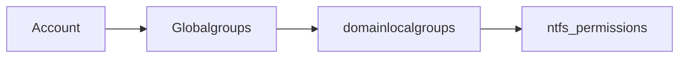

#windows 

AGDLP: Accounts, Global groups, Domain Local Groups Permissions

- Accounts --inside--> Global groups
- Global groups --inside--> Domain local groups
- Domain Local groups --bound to--> in ntfs permissions/sharepoint/sql/exchange

# Group Policies

Location of group policy files = SYSVOL share op de domain controllers. 
All authenticated users and computers have read permissions on this share.
### Group policies => registry
All group policy settings are in fact linked to a setting in the local registry
### Block policies
Will not allow to inherit policies from higher level policies. (except enforce)
### Enforce policies
These policies will never be overwritten by child defined policies even when the child is set as Block!
## User settings

- User configuration settings will be applied to HKEY_Users.
- How to update settings:
	- gpupdate
	- every 90min (default)
	- re-login
## Computer settings
- Computer configuration settings will be applied to HKEY_Localmachine
- How to update:
	- reboot
	- every 90min
## Deploying applications with GPO
- msi
- exe
- appx -> containerd and platform independent 
- msix

Steps to deploy an application.
1. create the gpo
2. make the applications available on a central share
3. deploy

# DSC
niet kennen